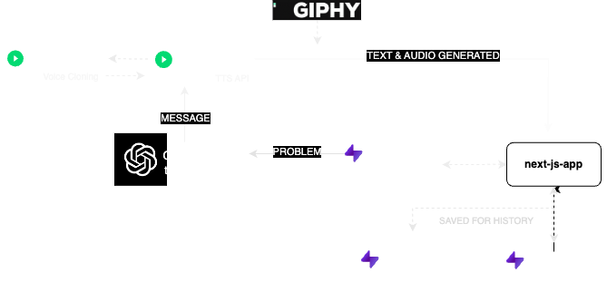

### Project was built for the Supabase Launch: Week 8 Hackathon
---

    The (Talk-No Justu Tool) is built using <code>Next JS</code> specially for the <code>Supabase Launch Week 8 Hackathon</code>. The main focus of this tool is to receive any kind of problems aka "mental stress or anything you always wanted to shout at your friend" and process it using <code>Generative AI</code> - <code>Open AI</code> and provides you with a fun filled page of realistic anime voice using <code>Play HT</code> advising you with motivation or message. The thing to notice is due to empty pocket the entire site is running on free and open source resources and thus only two characters namely "Naruto Uzumaki" and "Gaara" are used.

## Technologies Used
- NextJS
- Tailwind CSS
- Open AI
- Play HT
- Giphy
- Supabase

## Site Demo

<a href="https://www.loom.com/share/adc5a2ca1ddb448b9d96adfd2186174e">
    
View Demo Video

</a>

## Need to see how it works in detail ?

<a href="https://talkno-justu.netlify.app">See More in detail</a>

## To run the project
- Fork or download the project from <code>https://github.com/imprakashraghu/talkno-justu-tool</code>
- ⭐️ Star if possible!
- Create the <code>.env</code> file in the project directory and add the following variables.
    - <code>NEXT_PUBLIC_SUPABASE_ANON_KEY</code> (Supabase ANON KEY)
    - <code>NEXT_PUBLIC_SUPABASE_URL</code> (Supabase PROJECT URL)
    - <code>NEXT_PUBLIC_OPENAI_API_KEY</code> (Open AI API KEY)
    - <code>GIPHY_KEY</code> (Giphy KEY)
    - <code>PLAY_HT_1</code> (API KEY - PLAY HT - NARUTO)
    - <code>PLAY_HT_2</code> (API KEY - PLAY HT - GAARA)
    - <code>PLAY_HT_1_UID</code> (USER ID - PLAY HT - NARUTO)
    - <code>PLAY_HT_2_UID</code> (USER ID - PLAY HT - GAARA)
    - <code>PLAY_HT_VOICE_1_ID</code> (PLAY HT - NARUTO CLONED VOICE ID)
    - <code>PLAY_HT_VOICE_2_ID</code> (PLAY HT - GAARA CLONED VOICE ID)
- Run the command <code>npm install</code> to install all dependencies
- Run the command <code>npm run dev</code> to run the project

### Disclaimer
The entire project was built just for fun and for the main purpose of the hackathon conducted and no commercial purpose was intended. Thus any audio or images used in the demo, images or website is just for personal use alone.
